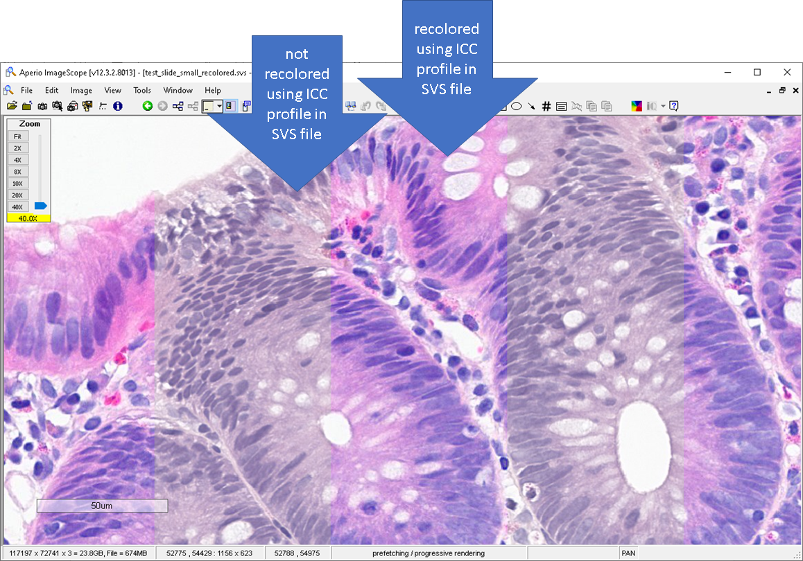
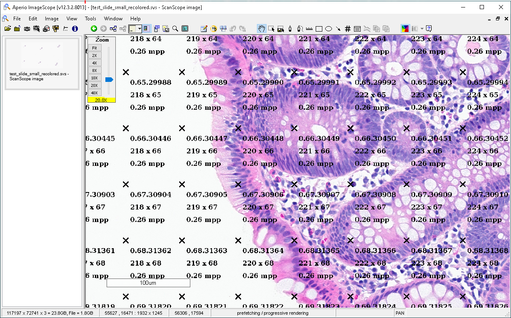
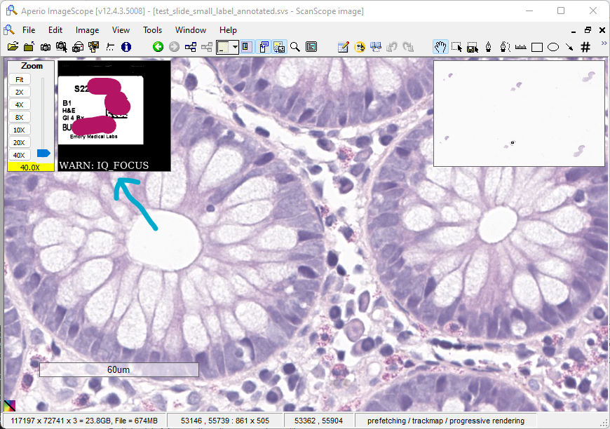
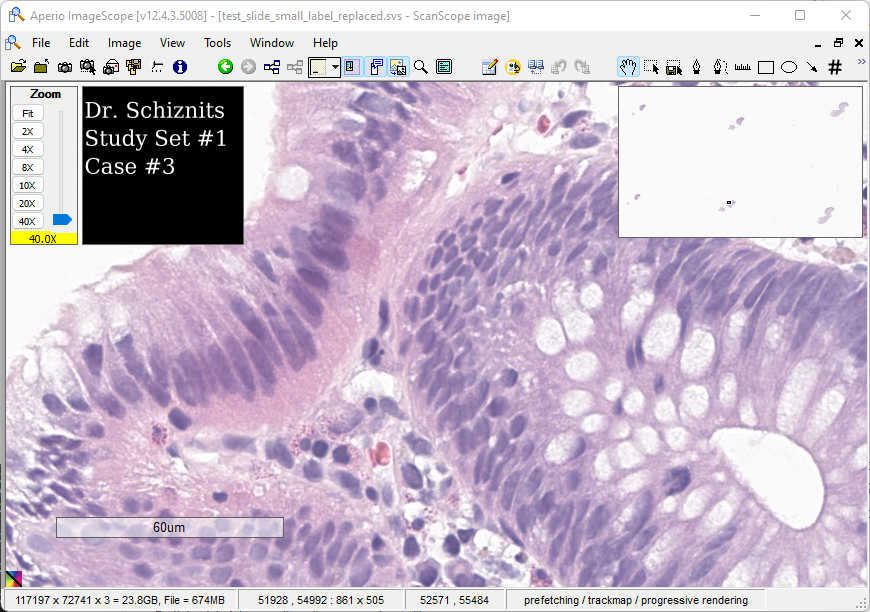

# SVS Utilities

These utilities have only been tested with ScanScope Virtual Slide (SVS) files acquired on a Leica/Aperio GT450 scanner in one focal plane. See "Technical Details" below.

If you try these utilities on an SVS file created by another Leica/Aperio scanner model and/or something doesn't work, let me know (geoffrey.smith@emory.edu) and I'll work on it!

This is a Java project that builds an executable JAR with Maven (i.e., "mvn package"). This project uses the J2SE API and does not rely on any native libraries (e.g. OpenSlide). An LZW encoder/decoder from https://haraldk.github.io/TwelveMonkeys/ is used (slide labels are LZW encoded).

```
git clone https://github.com/ghsmith/SVSUtil
mvn package
```

## [Re]color Utility

This utility recolors the image tiles in an SVS file using the International Color Consortium (ICC) profile embedded in the SVS metadata.
This might be useful when you need to render an SVS file using an application that is not color-managed.
To be clear, any software rendering an SVS file should respect the ICC profile in the SVS metadata and perform these color corrections automatically, but I have found that some software that renders SVS files does not respect the ICC profile in the SVS metadata and renders the compressed color gamut of the scanner instead of the full sRGB color gamut you'd like to see.

The positions of the TIFF headers and contiguous blocks of tiles in the SVS file are maintained.
The recolored SVS file is the same size as the original SVS file.
If the recolored tiles do not fit into the space available in the SVS file, either use the resize option or reduce the JPEG compression quality by one (e.g., from 87 to 86), which usually allows the recolored tiles to fit into the space available.

```
usage: java -jar svsutil.jar colorutil [options] svs_file_name
 -a,--annotate        if specified, annotate every tile with its tile ID
                      and microns per pixel (default = do not annotate)
 -n,--norecolor       if specified, tiles are rewritten at specified
                      quality, but not recolored (default = do recolor)
 -q,--quality <arg>   JPEG compression quality, integer 0 - 100 (default =
                      87)
 -r,--resize          if specified, allow program to resize the SVS file
                      (default = do not resize file)
 -s,--skip <arg>      skip this many tiles when recoloring; used to create
                      interesting patterns of raw/recolored tiles, integer
                      (default = 0)
 -t,--threads <arg>   number of parallel threads, integer (default = 4)
```

The following SVS was created using this command line:

`java -jar svsutil.jar colorutil -q80 -s1 -t24 test_slide_small.svs`
  


The following SVS was created using this command line:

`java -jar svsutil.jar colorutil -t24 -r -a test_slide_small.svs`
  


Although it is obvious to say this, I have found that the best performance is achieved with more recent OpenJDK releases on CPUs with many cores. All SVS file operations are performed in-memory, so it may be necessary to increase your Java heap size for large files. For example, the following command line uses OpenJDK 17 with a 4GB heap and runs in 24 concurrent threads:

`/usr/lib/jvm/java-17-openjdk-amd64/bin/java -Djava.awt.headless=true -Dawt.toolkit=sun.awt.HToolkit -Xms4G -Xmx4G -jar svsutil.jar colorutil -t24 test_slide.svs`

## Label Utility

This utility manipulates the label in an SVS file.

```
usage: java -jar svsutil.jar labelutil [options] svs_file_name
 -a,--annotate <arg>   add string annotation to label (e.g., -a "test
                       annotation")
 -m,--monochrome       if specified, any label written to SVS is converted
                       to monochrome (default = do not use monochrome)
 -r,--resize           if specified, allow program to resize the SVS file
                       (default = do not resize file)
 -s,--string <arg>     replace label entirely with a string (e.g., -r
                       "study set #1<br/>case#2")
 -x,--extract          extract label to JPG
```
The following SVS was created using this command line:

`java -jar svsutil.jar labelutil -a "WARN: IQ_FOCUS" test_slide_small.svs`
  


The following SVS was created using this command line:

`java -jar svsutil.jar labelutil -s "Dr. Schiznits<br/>Study Set #1<br/>Case #3" test_slide_small.svs`
  


## Technical Details

### Leica/Aperio GT450 at 40x - one focal plane

The SVS files generated by our GT450 scanners contain 7 TIFF directories in this order:

- TIFF Directory #0 - High-resolution (0.26 microns/pixel) histology. 256x256 pixel 24-bit color JPG image tiles. This directory includes an ICC profile. These image tiles are recolored by "colorutil."
- TIFF Directory #1 - Thumbnail histology. 24-bit color JPG image (not tiled). This directory includes an ICC profile. This image is NOT recolored by "colorutil."
- TIFF Directory #2 - Medium-high-resolution (1.1 microns/pixel) histology. 256x256 pixel 24-bit color JPG image tiles. This directory includes an ICC profile. These image tiles are recolored by "colorutil."
- TIFF Directory #3 - Medium-low-resolution (4.2 microns/pixel) histology. 256x256 pixel 24-bit color JPG image tiles. This directory includes an ICC profile. These image tiles are recolored by "colorutil."
- TIFF Directory #4 - Low-resolution (17 microns/pixel) histology. 256x256 pixel 24-bit color JPG image tiles. This directory includes an ICC profile. These image tiles are recolored by "colorutil."
- TIFF Directory #5 - Label. Horizontally-differenced LZW-encoded 24-bit color bitmap (not tiled). This directory does not include an ICC profile. This image is not recolored by "colorutil" but is manipulated by "labelutil."
- TIFF Directory #6 - Low-resolution "macro" image of entire slide, including a portion of the label, annotated with scan area, focus points, and white balance point. 24-bit color JPG image (not tiled). This directory does not include an ICC profile. This image is not recolored by "colorutil."

The ICC profiles in #0 - #4 are identical and primarily consist of a 103 x 103 x 103 color lookup table (CLUT). Since the ICC profiles are identical, "colorutil" uses the ICC profile in #0 for all color correction operations. All JPG encoding/decoding and color transformations are performed using standard Java API calls. I believe modern OpenJDK versions use the well-respected Little-CMS color management system. In order to prevent double-color transformation, the ICC profile in the generated SVS file is clobbered.

The JPG tiles include a JFIF application segment (APP0) and can be rendered without any manipulation. For example, if you know the offset and length of a tile (e.g., from "tiffdump") then the following "dd" command will extract a JPG you can view in any JPG viewer:

`dd if=file.svs of=tile.jpg skip={offset-to-tile} count={tile-length} iflag=skip_bytes,count_bytes`

### Leica/Aperio AT2 at 20x (can also do 40x, see next section) - one focal plane

The SVS files generated by our AT2 scanners contain 5 TIFF directories in this order:

...coming soon...
 
The JPG tiles are unusual because they are not converted to a YCrCb colorspace before JPG encoding, rather they are "native RGB" encoded. Care must be taken to ensure that the client rendering a tile knows this or the client will treat the decoded RGB data like YCrCb data and convert it, resulting in mangled colors. Unlike with the GT450, the AT2 tiles do not include an application segment (so you must provid this) or any JPG tables (these are stored at a separate offset in the SVS file, but you must inject the tables into each tile). I think the easiest way to make sure these tiles are rendered properly is to prepend an "Adobe" (APP14) segment that specifies no color transform (i.e., "0xff 0xfe 0x00 0x0e A d o b e 0x00 0x00 0x00 0x00 0x00 0x00 0x00") followed by the quantization and Huffman tables to the tile bytes in the SVS. Do not prepend a JFIF application segment (APP0), or that will defeat the "Adobe" (APP14) segment.
 
 ### Leica/Aperio AT2 at 40x (can also do 20x, see prior section) - one focal plane

...coming soon...
 
